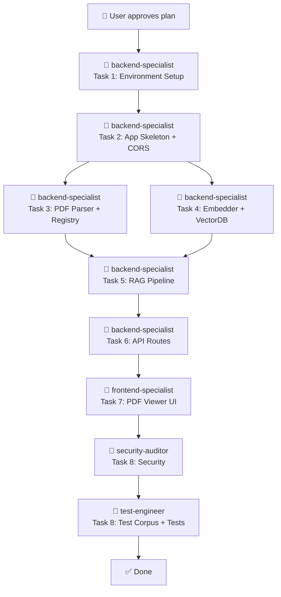

# Citation RAG — PDF Viewer with RAG-Powered Citation Verification

## Goal

Build a **local web application** that lets a researcher:

1. **Forward mode →** Paste a statement → find which stored article (and which passage in it) best supports that statement.
2. **Backward mode →** Open a PDF → hover over a citation marker (e.g. `[12]`) → see a tooltip with the most likely passage from the cited article that sustains the claim. If the cited paper isn't in the database, show an error: *"Paper not found. Please ingest it first."*

The entire system runs **locally on a Mac mini with 16GB RAM**. No cloud services, no API keys, no subscriptions.

---

## Decisions (from user feedback)

| Question | Decision |
|----------|----------|
| **Citation style** | IEEE numbered brackets `[1]`, `[1, 3]`, `[1-5]` |
| **Backward mode** | Option (a): look up the specific cited paper. If not ingested → show error message |
| **Test corpus** | Create 5 downloadable open-access papers + a LaTeX dummy document that cites them |
| **LLM model** | **Gemma 4 E2B** (2.3B effective params) — see rationale below |
| **Frontend style** | Scholarly-minimal, inspired by Zotero/Notion hybrid — see UI section below |

---

## LLM Model Decision: Why Gemma 4 E2B

> [!NOTE]
> **Why not Phi-4-mini or Qwen2.5 7B?**
> 
> After researching all three options, **Gemma 4 E2B** is the best choice for this project:
> 
> | Model | Params | RAM (Q4_K_M) | Reasoning | Deciding factor |
> |-------|--------|-------------|-----------|-----------------|
> | **Gemma 4 E2B** | 2.3B effective | **~1.5 GB** | Strong general + 256K context | ✅ Smallest footprint, 2026 architecture, leaves most RAM free |
> | Phi-4-mini | 3.8B | ~2.5 GB | Best math/logic | ❌ Overkill — we don't need math, we need text matching |
> | Qwen2.5 7B | 7B | ~4.5 GB | Great all-round | ❌ Uses 3× more RAM for marginal benefit in our text-retrieval use case |
> 
> **Our task is text retrieval + passage reranking**, not math or coding. Gemma 4 E2B excels at general reasoning and text understanding with the smallest footprint. It uses Google's 2026 Per-Layer Embeddings architecture, so it punches above its weight.
> 
> **The model is configurable** via `.env` — if Gemma 4 E2B isn't accurate enough, you can swap to `gemma4:e4b` (4.5B) or `phi4-mini` without changing any code.

> [!NOTE]
> **On quantization (TurboQuant / Q2-Q4):**
> 
> With Gemma 4 E2B being only 2.3B params, it's already tiny. At Q4_K_M (default in Ollama), it uses ~1.5 GB RAM — there's no need to go lower. Going to Q2 or Q3 would save maybe 0.5 GB but risk degrading output quality noticeably. **Q4_K_M is the sweet spot** and the default Ollama quantization.
> 
> TurboQuant (aggressive Q2/Q3) would only be worth it if we were running a 14B+ model on 16 GB, which we're not.

---

## Architecture

> [!NOTE]
> This diagram is also saved as `docs/ARCHITECTURE.md` in the project directory.

```
┌─────────────────────────────────────────────────────────┐
│                    BROWSER (localhost:8000)              │
│  ┌───────────────────────────────────────────────────┐  │
│  │              pdf.js Viewer + Overlay               │  │
│  │  ┌─────────────┐  ┌────────────────────────────┐  │  │
│  │  │  PDF Canvas  │  │  Citation Tooltip Overlay  │  │  │
│  │  └─────────────┘  └────────────────────────────┘  │  │
│  │  ┌─────────────────────────────────────────────┐  │  │
│  │  │  Forward Search Panel (paste → find source) │  │  │
│  │  └─────────────────────────────────────────────┘  │  │
│  └───────────────────────────────────────────────────┘  │
│                          │ HTTP/REST                    │
└──────────────────────────┼──────────────────────────────┘
                           │
┌──────────────────────────┼──────────────────────────────┐
│                  FastAPI Backend                         │
│  ┌────────────┐  ┌──────────────┐  ┌────────────────┐  │
│  │ /api/ingest│  │/api/search   │  │/api/cite-check │  │
│  │ (upload &  │  │(forward mode)│  │(backward mode) │  │
│  │  index PDF)│  │              │  │                │  │
│  └─────┬──────┘  └──────┬───────┘  └───────┬────────┘  │
│        │                │                   │           │
│  ┌─────▼────────────────▼───────────────────▼────────┐  │
│  │              RAG Service Layer                     │  │
│  │  PyMuPDF → Chunk → Embed → Store/Retrieve         │  │
│  └──────┬────────────────────┬───────────────────────┘  │
│         │                    │                          │
│  ┌──────▼──────┐   ┌────────▼────────┐                 │
│  │  ChromaDB   │   │  Ollama (LLM)   │                 │
│  │  (vectors + │   │  Gemma 4 E2B    │                 │
│  │  metadata)  │   │  (rerank +      │                 │
│  │             │   │   summarize)    │                 │
│  └─────────────┘   └─────────────────┘                 │
└─────────────────────────────────────────────────────────┘

Data Flow:

  INGEST:
    PDF → PyMuPDF text → extract paper metadata (title, authors, journal)
        → parse reference list → sentence chunks → embed → ChromaDB
        → store metadata: {paper_id, title, authors, journal, page, chunk_idx}

  FORWARD:
    statement → embed → ChromaDB top-k → LLM rerank → best passage + source
    → if no passage above confidence threshold → "No relevant text found"

  BACKWARD:
    citation [N] in Paper A
      → parse Paper A's reference list → find reference [N]
      → match reference to ingested paper (by title/authors)
      → if not found → "Paper not found. Please ingest it."
      → if found → ChromaDB search ONLY that paper's chunks
      → LLM extract most relevant passage → tooltip
```

### How Citation → Paper Matching Works (Backward Mode)

This is the key question you raised. Here's the strategy:

1. **During ingestion** of each PDF, we extract and store **paper metadata**: title, first-author last name, year, journal (when available). This is stored both in ChromaDB chunk metadata AND in a simple JSON registry (`backend/data/paper_registry.json`).

2. **During ingestion**, we also parse the **reference list** at the end of each paper. Each reference entry gets: `{ref_number: 12, raw_text: "Smith et al., J. Climate, 2019...", parsed_title: "...", parsed_first_author: "...", parsed_year: "..."}`.

3. **When checking citation `[12]` in Paper A:**
   - Look up Paper A's reference list → get entry `[12]` → e.g. `"Smith, J. Climate, 2019, Ocean warming..."`
   - Search the paper registry for a match: compare title words + first author + year
   - If match found → search only that paper's chunks in ChromaDB (using `where={"paper_id": matched_id}`)
   - If no match → return error: "Cited paper not in database"

This approach is **simple and doesn't require an LLM** for the matching step — just fuzzy string comparison.

---

## Tech Stack

| Layer | Technology | Version | RAM Usage |
|-------|-----------|---------|-----------|
| **Runtime** | Python 3.11+ | 3.11+ | ~100 MB |
| **Backend** | FastAPI + Uvicorn | 0.115+ | ~50 MB |
| **PDF parsing** | PyMuPDF (pymupdf) | 1.25+ | ~30 MB |
| **Embeddings** | sentence-transformers (`all-MiniLM-L6-v2`) | 3.3+ | ~300 MB |
| **Vector store** | ChromaDB | 0.5+ | ~200 MB (scales with docs) |
| **LLM** | Ollama + Gemma 4 E2B (Q4_K_M) | latest | **~1.5 GB** |
| **Frontend** | Vanilla JS + pdf.js | 4.x | Browser |
| **Env mgmt** | Python venv | built-in | — |
| **Total estimated** | | | **~2.2 GB** (leaves ~10 GB for macOS + headroom) |

> [!TIP]
> With Gemma 4 E2B, total app RAM is ~2.2 GB — dramatically lower than the 5 GB estimate with Phi-4-mini. This leaves plenty of room for macOS, the browser, and your other apps.

---

## Frontend Design: Scholarly-Minimal

> [!NOTE]
> The visual identity is **inspired by a Zotero × Notion hybrid** — clean, content-focused, with subtle functional beauty. Not flashy. Academic gravitas.

### Style Characteristics

| Aspect | Choice | Rationale |
|--------|--------|-----------|
| **Base theme** | Dark mode (charcoal `#1a1a2e`, near-black `#16213e`) | Easy on eyes for extended reading |
| **Accent color** | Muted teal `#0f9b8e` | Scholarly, non-distracting, good contrast |
| **Typography** | `Inter` (UI) + `Source Serif Pro` (PDF text panels) | Clean sans for UI, serif for academic feel |
| **Layout** | Split panel: 65% PDF viewer / 35% search panel | Mirrors reference manager UX |
| **Cards/panels** | Flat with 1px border, subtle shadow, rounded corners (6px) | Boxy-minimal like Notion, not bubbly |
| **Tooltips** | Floating card with passage + source info, soft drop shadow | Appears on hover, non-intrusive |
| **Animations** | CSS transitions only: fade-in tooltips (200ms), slide-in results | Functional, not decorative |
| **Loading states** | Pulsing teal dot + "Analyzing..." text | LLM responses take 2-5 seconds, user needs feedback |
| **Icons** | Minimal SVG: upload, search, book, warning | No icon library — 4-5 hand-picked inline SVGs |

### Visual Reference
- **Like Zotero:** Clean PDF viewer, library management feel
- **Like Notion:** Card-based results, flat panels, generous whitespace
- **NOT like:** Flashy dashboards, gradient-heavy UIs, material design

---

## Project File Structure

> [!NOTE]
> This structure is also saved as `docs/FILE_STRUCTURE.md` in the project directory.

```
citation-rag/
├── .env                          # Config (model name, ports, paths)
├── .env.example                  # Template for .env (committed to git)
├── .gitignore
├── requirements.txt              # Python dependencies
├── README.md
│
├── docs/
│   ├── ARCHITECTURE.md           # System architecture diagram + ADRs
│   └── FILE_STRUCTURE.md         # This file structure reference
│
├── backend/
│   ├── __init__.py
│   ├── main.py                   # FastAPI app, CORS, static files
│   ├── config.py                 # Settings from .env (Pydantic BaseSettings)
│   ├── models.py                 # Pydantic request/response schemas
│   │
│   ├── services/
│   │   ├── __init__.py
│   │   ├── pdf_parser.py         # PyMuPDF text extraction + citation detection
│   │   ├── reference_parser.py   # Parse reference list from paper (IEEE style)
│   │   ├── paper_registry.py     # JSON registry: paper metadata + matching
│   │   ├── chunker.py            # Sentence-level chunking logic
│   │   ├── embedder.py           # sentence-transformers wrapper
│   │   ├── vector_store.py       # ChromaDB operations (add, query, filter by paper_id)
│   │   ├── llm_client.py         # Ollama HTTP API wrapper
│   │   └── rag_pipeline.py       # Orchestrates: ingest / forward / backward flows
│   │
│   ├── routes/
│   │   ├── __init__.py
│   │   ├── ingest.py             # POST /api/ingest (upload PDF)
│   │   ├── search.py             # POST /api/search (forward mode)
│   │   └── cite.py               # POST /api/cite-check (backward mode)
│   │
│   └── data/                     # Local storage (gitignored)
│       ├── pdfs/                 # Uploaded PDFs
│       ├── chroma_db/            # ChromaDB persistent storage
│       └── paper_registry.json   # Metadata of all ingested papers
│
├── frontend/
│   ├── index.html                # Main page: PDF viewer + panels
│   ├── css/
│   │   └── style.css             # All styles (scholarly-minimal dark theme)
│   ├── js/
│   │   ├── app.js                # Main app logic, state management
│   │   ├── pdf-viewer.js         # pdf.js integration + page rendering
│   │   ├── citation-overlay.js   # Hover detection + tooltip rendering
│   │   ├── forward-search.js     # Forward mode panel logic
│   │   └── api-client.js         # Fetch wrappers for backend API
│   └── lib/
│       └── pdf.min.js            # pdf.js library (vendored)
│
├── test_corpus/                  # Dummy test data (committed)
│   ├── papers/                   # 5 open-access PDFs
│   ├── dummy_citing_paper.tex    # LaTeX doc that cites the 5 papers
│   ├── dummy_citing_paper.pdf    # Compiled version
│   └── README.md                 # Explains what each paper is
│
└── tests/
    ├── __init__.py
    ├── conftest.py               # Shared fixtures (sample PDFs, test ChromaDB)
    ├── test_pdf_parser.py        # Unit: text extraction + citation regex
    ├── test_reference_parser.py  # Unit: reference list parsing
    ├── test_paper_registry.py    # Unit: paper metadata matching
    ├── test_chunker.py           # Unit: sentence boundary chunking
    ├── test_rag_pipeline.py      # Integration: full ingest → query flow
    └── test_api.py               # Integration: FastAPI endpoint tests
```

---

## CORS Middleware — What Is It?

> [!NOTE]
> **CORS** stands for **Cross-Origin Resource Sharing**. Here's why it matters:
> 
> When your browser loads the frontend from `http://localhost:8000`, and the JavaScript makes API calls to `http://localhost:8000/api/search`, the browser checks: "Is this JavaScript allowed to talk to this server?" This check is called CORS.
> 
> **By default, browsers block JavaScript from making requests to a different origin** (a different domain, port, or protocol). Even though our frontend and backend are on the SAME server (`localhost:8000`), we add CORS middleware as a safety net in case:
> - During development, you run the frontend separately (e.g., on port 3000)
> - Someone tries to access your API from an external page
> 
> **Our CORS config:** We will allow ONLY `localhost` origins. This prevents any external website from calling our API — a basic but important security measure.
> 
> **In simple terms:** CORS middleware is a security guard at the door of our API that checks the ID of every request and only lets in requests from our own frontend.

---

## Proposed Changes

### Phase 1: Foundation (Environment + Config)

#### [NEW] `.env` + `.env.example`
- All configurable values: Ollama URL (`http://localhost:11434`), model name (`gemma4:e2b`), ChromaDB path, embedding model name, chunk size (~500 tokens), API port (8000).
- `.env.example` committed to git as template; `.env` gitignored.

#### [NEW] `requirements.txt`
```
fastapi>=0.115
uvicorn[standard]>=0.30
pymupdf>=1.25
chromadb>=0.5
sentence-transformers>=3.3
httpx>=0.27
pydantic>=2.0
pydantic-settings>=2.0
python-multipart
nltk>=3.9
pytest>=8.0
pytest-asyncio>=0.24
httpx>=0.27
```

#### [NEW] `backend/config.py`
- Pydantic `BaseSettings` that reads from `.env`.

---

### Phase 2: PDF Parsing + Reference Extraction

#### [NEW] `backend/services/pdf_parser.py`
- Uses `pymupdf` to extract text page-by-page.
- Detects IEEE citation markers with regex: `\[[\d,\s\-–]+\]`.
- Returns structured data: `{pages: [{page_num, text, citations: [{marker, position}]}]}`.

#### [NEW] `backend/services/reference_parser.py`
- Extracts the reference list section (usually at the end of the paper).
- For each `[N]` reference, parses: `{ref_number, raw_text, parsed_title, parsed_first_author, parsed_year}`.
- Strategy: regex-based extraction of the numbered reference block. 
  - Look for a "References" or "Bibliography" heading.
  - Each entry starts with `[N]` and continues until `[N+1]` or end of text.
  - Parse author/title/year from the raw text using heuristics (first author = text before first comma; year = 4-digit number; title = text between author and journal).

#### [NEW] `backend/services/paper_registry.py`
- JSON file-based registry of all ingested papers.
- Each entry: `{paper_id, title, first_author, year, journal, keywords, filename, num_chunks}`.
- `match_reference(parsed_ref) → paper_id | None` — fuzzy string matching (title similarity + author + year).

---

### Phase 3: Embedding + Vector Store

#### [NEW] `backend/services/embedder.py`
- Thin wrapper around `sentence-transformers`.
- Loads `all-MiniLM-L6-v2` once at startup.
- Exposes: `embed_text(text) → vector`, `embed_batch(texts) → vectors`.

#### [NEW] `backend/services/vector_store.py`
- Wraps ChromaDB: create collection, add documents with metadata, query by vector.
- **Key feature:** Each chunk stores metadata `{paper_id, title, first_author, page_num, chunk_idx}`.
- Supports **filtered queries**: `query(text, where={"paper_id": "xyz"})` — so backward mode only searches the cited paper's chunks.
- Persistent storage in `backend/data/chroma_db/`.

---

### Phase 4: LLM Integration

#### [NEW] `backend/services/llm_client.py`
- HTTP client to Ollama's REST API (`POST http://localhost:11434/api/generate`).
- Uses `httpx` async client.
- Configurable model name via `.env`.
- Timeout handling + retry logic.

#### [NEW] `backend/services/rag_pipeline.py`
- **Forward mode:** `query_text → embed → ChromaDB top-k → LLM rerank → best passage + source`. If no result above confidence threshold (cosine similarity < 0.3) → return `{"found": false, "message": "No relevant text found in the database for this query."}`.
- **Backward mode:** `[N] + paper_id → reference_parser → paper_registry.match → if not found → error → if found → ChromaDB filtered search → LLM extract → passage + confidence`.
- **Ingest mode:** `PDF → pdf_parser → reference_parser → paper_registry.register → chunker → embedder → vector_store.add`.

---

### Phase 5: API Routes

#### [NEW] `backend/routes/ingest.py`
- `POST /api/ingest` — accepts PDF file upload.
- Pipeline: parse → extract metadata → register in paper_registry → chunk → embed → store.
- Returns: `{paper_id, title, first_author, year, num_pages, num_chunks, num_references, status}`.
- **Security:** validates file type (only `.pdf`), limits file size (50 MB), sanitizes filename.

#### [NEW] `backend/routes/search.py`
- `POST /api/search` — forward mode.
- Input: `{query: "statement text", top_k: 5}`.
- Output: `{found: true/false, results: [{passage, source_pdf, title, first_author, page_num, relevance_score, llm_explanation}], message: "..." (if not found)}`.

#### [NEW] `backend/routes/cite.py`
- `POST /api/cite-check` — backward mode.
- Input: `{citation_marker: "[12]", context: "the sentence containing the citation", pdf_id: "current_pdf_id"}`.
- Output on success: `{found: true, cited_paper: {title, authors, year}, best_passage, page_num, confidence}`.
- Output on not found: `{found: false, message: "Paper not found in database. Please ingest it first."}`.

#### [NEW] `backend/main.py`
- FastAPI app creation.
- **CORS middleware:** configured to allow only `localhost` origins (see CORS explanation above).
- Static file serving for frontend.
- Startup event: load embedding model, initialize ChromaDB, check Ollama connectivity.

---

### Phase 6: Frontend — PDF Viewer

#### [NEW] `frontend/index.html`
- Scholarly-minimal dark layout: 65/35 split (PDF viewer / search panel).
- Loads pdf.js + app scripts.

#### [NEW] `frontend/css/style.css`
- Dark charcoal theme (`#1a1a2e` base, `#0f9b8e` accent).
- `Inter` for UI text, `Source Serif Pro` for result passages.
- Flat cards, 1px borders, 6px radius.
- Tooltip styles for citation hover.
- Loading pulse animation.
- Responsive: collapses to stacked view on narrow screens.

#### [NEW] `frontend/js/pdf-viewer.js`
- Renders PDF pages using pdf.js `<canvas>`.
- Page navigation + zoom.

#### [NEW] `frontend/js/citation-overlay.js`
- Scans pdf.js text layer for `[N]` markers.
- On hover → calls `POST /api/cite-check` → shows tooltip.
- Tooltip content: paper title, authors, year, best supporting passage, page number, confidence bar.
- Error state: red-tinted tooltip saying "Paper not found. Please ingest it."

#### [NEW] `frontend/js/forward-search.js`
- Text input + "Find Source" button.
- Results as cards with passage, source info, relevance score.
- "No relevant text found" state with suggestion to ingest more papers.

#### [NEW] `frontend/js/api-client.js`
- Centralized `fetch()` wrappers.
- Error handling + loading state management.

---

### Phase 7: Testing

> [!IMPORTANT]
> **Test integrity rules** — these tests are designed so that a code-generating LLM (e.g., Codex, a smaller model) cannot fake passing results:

#### [NEW] `tests/test_pdf_parser.py` — Unit Tests
| Test | Method | Anti-cheat mechanism |
|------|--------|---------------------|
| `test_extract_text_returns_nonempty` | Open a real sample PDF → extract text → assert `len(text) > 100` | Uses a **committed sample PDF** — the LLM would have to actually extract text |
| `test_citation_regex_finds_brackets` | Parse known text `"as shown [1] and [2, 3]"` → assert found `["[1]", "[2, 3]"]` | **Exact expected output** — can't fudge the regex |
| `test_citation_regex_ignores_equations` | Parse `"solve [x + y = 0]"` → assert no citations found | **Negative test** — must NOT match |
| `test_multipage_extraction` | 3-page PDF → verify 3 pages returned with distinct text per page | **Page-count assertion** is verifiable against the real file |

#### [NEW] `tests/test_reference_parser.py` — Unit Tests
| Test | Method | Anti-cheat mechanism |
|------|--------|---------------------|
| `test_finds_references_section` | Known text with "References" header + 3 entries → assert count == 3 | **Exact count against known input** |
| `test_parses_ieee_format` | Input: `[1] Smith, J., "Title here," J. Climate, 2019.` → assert `first_author == "Smith"`, `year == "2019"` | **Exact field values** |
| `test_handles_missing_references` | Paper text with no "References" section → returns empty list, no crash | **Edge case** — must not throw |

#### [NEW] `tests/test_paper_registry.py` — Unit Tests
| Test | Method | Anti-cheat mechanism |
|------|--------|---------------------|
| `test_register_and_lookup` | Register paper with title "Ocean Warming Trends" → lookup by title → assert found | **Round-trip test** |
| `test_fuzzy_match` | Register "Ocean Warming Trends" → search for "ocean warming trend" (different case, singular) → assert match | **Fuzzy matching must work** on specific strings |
| `test_no_match_returns_none` | Search for "Quantum Computing" when only climate papers ingested → assert `None` | **Must NOT hallucinate a match** |

#### [NEW] `tests/test_chunker.py` — Unit Tests
| Test | Method | Anti-cheat mechanism |
|------|--------|---------------------|
| `test_chunks_respect_sentences` | Input: 3 sentences → chunk → no chunk ends mid-sentence | **Check last char of each chunk is sentence-ending punctuation** |
| `test_chunk_size_limit` | Input: 2000-word text, limit 500 tokens → assert all chunks < 550 tokens | **Numeric bound assertion** |
| `test_chunk_metadata` | Chunk a text → each chunk must have `source_pdf`, `page_num`, `chunk_idx` keys | **Schema validation** |

#### [NEW] `tests/test_rag_pipeline.py` — Integration Tests
| Test | Method | Anti-cheat mechanism |
|------|--------|---------------------|
| `test_ingest_and_forward_search` | Ingest sample PDF → search for a sentence KNOWN to be in it → assert it's in top-3 results | **Uses a committed PDF with known contents** — result must contain specific substring |
| `test_forward_search_no_match` | Search for "quantum entanglement" in a climate-science-only corpus → assert `found == false` | **Negative result test** — must return not-found |
| `test_backward_cite_found` | Ingest Paper A (which cites Paper B) + ingest Paper B → cite-check [1] in Paper A → assert returns passage from Paper B | **End-to-end verification** against known citation relationships |
| `test_backward_cite_not_found` | Ingest Paper A (which cites Paper B) but DON'T ingest Paper B → cite-check [1] → assert error message | **Must return specific error message** |

#### [NEW] `tests/test_api.py` — Integration Tests
| Test | Method | Anti-cheat mechanism |
|------|--------|---------------------|
| `test_upload_pdf_success` | Upload valid PDF → assert 200 + response has `paper_id` | **Real file upload** |
| `test_upload_non_pdf_rejected` | Upload a `.txt` file → assert 400 | **Must reject** — can't fake a pass |
| `test_upload_oversized_rejected` | Upload 60 MB file → assert 413 | **Size validation** |
| `test_search_without_ingestion` | Search before ingesting anything → assert `found == false`, not crash | **Edge case** |

---

### Phase 8: Test Corpus + Verification (Phase X)

#### [NEW] `test_corpus/`
- 5 open-access scientific papers (will download from arXiv/PubMed Central — freely available, no copyright issues).
- A LaTeX dummy document (`dummy_citing_paper.tex`) that writes ~2 paragraphs citing all 5 papers in IEEE style.
- Compiled PDF of the dummy document.
- `README.md` explaining what each paper is and which paper is cited where.

**Paper selection criteria:**
- Open access (arXiv or CC-BY licensed)
- Different topics (to test that search doesn't cross-contaminate)
- Short (10-15 pages max, to keep ingestion fast)

---

## Task Breakdown

### Task 1: Environment Setup
- **Agent:** `backend-specialist`
- **Skills:** `python-patterns`, `bash-linux`
- **Priority:** P0 (blocker)
- **INPUT:** Empty project
- **OUTPUT:** Python venv in `.env/`, `requirements.txt` installed, `.env` configured, Ollama installed + `gemma4:e2b` pulled, `docs/ARCHITECTURE.md` + `docs/FILE_STRUCTURE.md` created
- **VERIFY:** `source .env/bin/activate && python -c "import fastapi, chromadb, pymupdf"` succeeds; `ollama list` shows gemma4:e2b

### Task 2: Config + App Skeleton
- **Agent:** `backend-specialist`
- **Skills:** `python-patterns`, `clean-code`
- **Priority:** P0
- **Dependencies:** Task 1
- **INPUT:** Installed dependencies
- **OUTPUT:** `config.py`, `main.py` (empty FastAPI with CORS + health check), `models.py`
- **VERIFY:** `uvicorn backend.main:app` starts; `curl localhost:8000/health` returns `{"status": "ok"}`

### Task 3: PDF Parser + Reference Parser + Paper Registry
- **Agent:** `backend-specialist`
- **Skills:** `python-patterns`, `clean-code`
- **Priority:** P1
- **Dependencies:** Task 2
- **INPUT:** Sample PDF
- **OUTPUT:** `pdf_parser.py`, `reference_parser.py`, `paper_registry.py`, `chunker.py`
- **VERIFY:** `pytest tests/test_pdf_parser.py tests/test_reference_parser.py tests/test_paper_registry.py tests/test_chunker.py` — all pass

### Task 4: Embedder + Vector Store
- **Agent:** `backend-specialist`
- **Skills:** `python-patterns`
- **Priority:** P1
- **Dependencies:** Task 2
- **INPUT:** Chunked text
- **OUTPUT:** `embedder.py`, `vector_store.py` with filtered query support
- **VERIFY:** Store chunks from 2 papers → query with filter → only returns chunks from target paper

### Task 5: LLM Client + RAG Pipeline
- **Agent:** `backend-specialist`
- **Skills:** `python-patterns`, `clean-code`
- **Priority:** P1
- **Dependencies:** Tasks 3, 4
- **INPUT:** Working embedder + vector store + paper registry
- **OUTPUT:** `llm_client.py`, `rag_pipeline.py` with forward/backward/ingest modes
- **VERIFY:** `pytest tests/test_rag_pipeline.py` passes; forward returns relevant results; backward returns "not found" when paper is missing

### Task 6: API Routes
- **Agent:** `backend-specialist`
- **Skills:** `python-patterns`, `api-patterns`, `clean-code`
- **Priority:** P1
- **Dependencies:** Task 5
- **INPUT:** Working RAG pipeline
- **OUTPUT:** `/api/ingest`, `/api/search`, `/api/cite-check` endpoints
- **VERIFY:** `pytest tests/test_api.py` passes

### Task 7: Frontend — PDF Viewer + Citation Overlay
- **Agent:** `frontend-specialist`
- **Skills:** `frontend-design`, `clean-code`
- **Priority:** P2
- **Dependencies:** Task 6
- **INPUT:** Working backend API
- **OUTPUT:** Full frontend with scholarly-minimal dark theme
- **VERIFY:** Open browser → upload PDF → rendered → hover citation → tooltip → forward search → results or "not found" message

### Task 8: Test Corpus + Final Verification (Phase X)
- **Agent:** `security-auditor` + `test-engineer`
- **Skills:** `vulnerability-scanner`, `testing-patterns`
- **Priority:** P3
- **Dependencies:** Task 7
- **INPUT:** Complete application
- **OUTPUT:** 5 sample papers + dummy citing doc + security scan report + full test suite green
- **VERIFY:** `python .agent/skills/vulnerability-scanner/scripts/security_scan.py .` no critical issues; `pytest tests/ -v` all green; manual demo works end-to-end

---

## Agent Workflow



> Tasks 3 and 4 can run **in parallel**. Everything else is **sequential**.

---

## Verification Plan

### Automated Tests
```bash
# From project root, with venv activated:
source .env/bin/activate
pytest tests/ -v --tb=short
```

### Manual Verification
1. `ollama serve` (start LLM)
2. `uvicorn backend.main:app --reload` (start app)
3. Open `http://localhost:8000`
4. Upload all 5 test corpus papers
5. Upload the dummy citing paper
6. **Forward test:** paste a known claim from paper #3 → verify paper #3 is in top results
7. **Backward test:** hover `[1]` in the dummy paper → verify tooltip shows passage from paper #1
8. **Not-found test:** hover a citation to a paper NOT ingested → verify error message
9. **No-match test:** forward search for "quantum computing" → verify "no relevant text" message
10. Activity Monitor → total RAM < 5 GB

### Security
```bash
python .agent/skills/vulnerability-scanner/scripts/security_scan.py .
```
